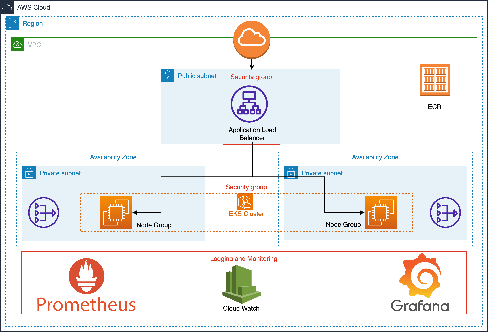

<h1 align="center">
  <br/><br/>
</h1>

# 🚀 Kubernetes Cluster Setup and Deployment with 'Hello Graylog' Pods

### 📚 Table of Contents

1. 🌟 [Introduction](#introduction)
2. ✨ [Features](#features)
3. 🔧 [Requirements](#requirements)
4. 🔍 [Technology Decisions](#technology-decisions)
5. 🛠️ [Components](#components)
6. 📋 [Usage](#usage)
  * 📥 [Clone the Repository](#clone-the-repository)
  * 🧪 [Test the Application](#test-the-application-locally-docker-compose)
  * 🚧 [Deploy with Terraform](#deploy-with-terraform)
7. [Further Additions](#further-additions)

## Introduction

This guide provides instructions on setting up an EKS cluster using Terraform and deploying a Helm chart with multiple components to display a "Hello" message. 
The application is accessible via a URL and is accompanied by a dashboard that monitors its health.

## Features
* Live Application [URL](https://graylog.joeyomi.69ideas.com/)
* Monitoring and Metrics
  * Prometheus metrics [route](https://graylog.joeyomi.69ideas.com/metrics)
  * Prometheus [dashboard](https://prom.graylog.joeyomi.69ideas.com/targets)
  * Grafana [dashboard](https://grafana.graylog.joeyomi.69ideas.com/d/yNtNqrmIk/go-webapp-monitoring?orgId=1). Login with `admin/prom-operator`.

**🚨 Note:** Note: The application introduces a random delay (0 to 1200ms) to simulate latency and a 15% error rate (500) for testing monitoring capabilities.


## Requirements

* Terraform version: `~> 1.2`
* AWS Provider version: `~> 4.0`
* Kubernetes `v1.25` or higher
* Helm `v3.x`
* Docker and Docker Compose
* Git

#### Terraform version compatibility

| Module version | Terraform version |
|----------------|-------------------|
| 0.x.x          | ~> 1.2            |


## Technology Decisions

| Name                    | Rationale                                   | Tradeoffs                                       | Alternatives               |
|-------------------------|---------------------------------------------|-------------------------------------------------|----------------------------|
| Golang                  | Performance, Familiarity                    | n/a                                             | Java, Python               |
| Helm                    | Versioning, Reproducibility                 | More complex than tools like Kustomize          | Kustomize                  |
| Grafana                 | Strong ecosystem support                    | Setup complexity                                | Datadog                    |
| Prometheus              | Strong ecosystem support                    | Setup complexity                                | Datadog                    |
| ALB Ingress Controller  | Integration with AWS ecosystem              | Missing advanced routing features (e.g., Istio) | Istio, Traefik             |
| Cluster Autoscaler      | Native Kubernetes support                   | Missing advanced features (e.g., Karpenter)     | Karpenter                  |
| CloudWatch Logging      | Integration with AWS ecosystem, Familiarity | Higher costs, less flexibility                  | ELK Stack, Splunk, Graylog |
| AWS Certificate Manager | Integration with AWS ecosystem              | Limited Kubernetes ecosystem support            | CertManager                |
| ECR                     | Integration with AWS ecosystem              | Limited Kubernetes ecosystem support            | DockerHub                  |


## Components

| Name                  | Location                                               |
|-----------------------|----------------------------------------------------------------------------|
| Application (code)    | `application/`                                                             |
| Application (helm)    | `terraform/helm/chart/`, `terraform/k8s-application.tf`                    |
| Grafana               | `terraform/k8s-monitoring.tf`, `application/configs/go_app_dashboard.json` |
| Prometheus            | `terraform/k8s-monitoring.tf`                                              |
| ALB Ingress Controler | `terraform/k8s-lb-controller.tf`                                           |
| Cluster Autoscaler    | `terraform/k8s-autoscaler.tf`                                              |
| EKS                   | `terraform/eks.tf`                                                         |


## Usage

### Clone the Repository:
```bash
# Clone the repo.
git clone https://github.com/joeyomi/graylog.git
cd graylog
```

### Test the Application locally (docker-compose)

```bash
# `cd` into the application directory.
cd application

# Build the and run the web app.
docker-compose up -d --build

# Generate some traffic with Apache bench.
ab -n 5000 -c 50 http://localhost/
```

* **Grafana**: Navigate to [Grafana](http://localhost:3000/).  
  Login with `admin/prom-operator` and access the `Go WebApp Monitoring` dashboard.
* **Prometheus**: Access the [Prometheus](http://localhost:9090/) dashboard.
* **Application**: Visit [localhost:80](http://localhost:80/).

### Deploy with Terraform
1. Modify or comment out the remote state configurations in terraform/provider.tf.
```hcl
  backend "s3" {
    bucket         = "joeyomi-terraform-state"
    dynamodb_table = "tf-remote-state-lock"
    key            = "tf-state/terraform.tfstate"
    region         = "us-east-1"
    encrypt        = true
  }
```

2. Update variable values in terraform/varfiles/common.tfvars.
```hcl
region = "us-east-1"

prefix            = "graylog"
route53_zone_name = "joeyomi.69ideas.com"

eks_admin_users = [
  "joseph.oyomi",
  "terraform-runner",
]
```

3. Provision resources:
```bash
# `cd` into the terraform directory.
cd terraform

terraform init
terraform plan -input=false -var-file=varfiles/common.tfvars -var-file=varfiles/develop.tfvars -out=plan.tfplan
terraform apply "plan.tfplan"
```

### [Create](https://docs.aws.amazon.com/apprunner/latest/dg/manage-custom-domains-route53.html) Route53 A records (Alias) for the Ingress ALB.
* Hello App (dns_name)
* Grafana (grafana.dns_name)
* Prometheus (prom.dns_name)

## Further additions

* Implement GitOps with FluxCD or ArgoCD.
* Use External DNS for automatic Ingress hostname addition to Route53.
